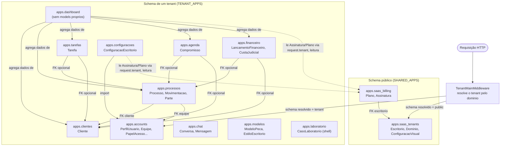

# Mapa de módulos

## Objetivo

Este documento mapeia os módulos existentes do Breno - LawSystem: sua
responsabilidade arquitetural, sua categoria (compartilhado ou de
tenant), suas dependências principais e a relação entre o nome técnico
do app Django e o domínio funcional correspondente descrito em
[docs/product/modules/](../product/modules/README.md).

## Regra de classificação

A classificação de cada módulo abaixo (compartilhado, de tenant,
infraestrutura, interface, ou planejado/parcialmente estruturado) não
foi presumida pelo nome do app. Ela foi confirmada em
`config/settings/base.py` (listas `SHARED_APPS` e `TENANT_APPS`) e, para
cada módulo, cruzada com a leitura de `apps/<app>/models.py`,
`apps/<app>/apps.py` e, quando existentes, `apps/<app>/views.py`.

## Módulos compartilhados

Confirmados em `SHARED_APPS`, em `config/settings/base.py`, além dos
apps padrão do Django (`django.contrib.*`) e do próprio `django_tenants`:

| Módulo técnico | Responsabilidade | Evidência | Observação |
| --- | --- | --- | --- |
| `apps.saas_tenants` | Cadastro de escritórios (tenants), domínios de acesso e configuração visual white label | `SHARED_APPS`, em `config/settings/base.py`; `apps/saas_tenants/models.py` define `Escritorio(TenantMixin)`, `Dominio(DomainMixin)` e `ConfiguracaoVisual` | `TENANT_MODEL` e `TENANT_DOMAIN_MODEL` apontam para este app |
| `apps.saas_billing` | Planos e assinaturas da plataforma SaaS | `SHARED_APPS`, em `config/settings/base.py`; `apps/saas_billing/models.py` define `Plano` e `Assinatura` (`OneToOneField` para `Escritorio`) | `apps/configuracoes/views.py` e `apps/dashboard/views.py` leem `request.tenant.assinatura` e `assinatura.plano.nome` para exibir o nome do plano em um badge de interface (leitura, sem escrita e sem lançamento financeiro). Nenhuma referência a `saas_billing`, `Plano` ou `Assinatura` foi encontrada em `apps/financeiro/`. A decisão aceita em [PDR-0003](../product/decisions/PDR-0003-areas-funcionais-financeiro.md) estabelece que o financeiro operacional do tenant e o billing SaaS são domínios distintos, que não há espelhamento automático da assinatura como despesa no Financeiro do tenant, e que uma eventual integração futura mais ampla exigiria um novo PDR |

## Módulos de tenant

Confirmados em `TENANT_APPS`, em `config/settings/base.py`:

| Módulo técnico | Domínio funcional | Responsabilidade arquitetural | Dependências relevantes |
| --- | --- | --- | --- |
| `apps.accounts` | Identidade, usuários, papéis, equipes | `PerfilUsuario` (OneToOne com `auth.User`), `Equipe`, `MembroEquipe`, e o mecanismo de autorização (`PapelAcesso`, `UsuarioPapel`, `PermissaoPapel`, `PermissaoUsuario`, `HabilitacaoPapel`, `HabilitacaoUsuario` em `apps/accounts/models.py`); helpers de resolução em `apps/accounts/permissoes.py` e de escopo em `apps/accounts/escopo.py` | Referenciado por `apps.processos` (FK `Processo.equipe` → `accounts.Equipe`), por `apps.configuracoes` (gestão de usuários/equipes/permissões) e por `apps.processos` via `apps.accounts.escopo.equipe_padrao_para_usuario` |
| `apps.dashboard` | Painel, indicadores agregados | Não possui `models.py` próprio; `apps/dashboard/views.py` importa e agrega dados de `apps.clientes.models.Cliente`, `apps.processos.models.Processo`, `apps.tarefas.models.Tarefa`, `apps.agenda.models.Compromisso` e `apps.financeiro.models.LancamentoFinanceiro`, e lê `request.tenant.assinatura.plano.nome` para exibição | Depende de Clientes, Processos, Tarefas, Agenda e Financeiro; lê (sem escrever) dados de `apps.saas_billing` via o tenant da requisição |
| `apps.clientes` | Cadastro de clientes | `Cliente` (FK `responsavel` → `auth.User`) | Referenciado por `apps.processos`, `apps.tarefas`, `apps.agenda`, `apps.financeiro` e `apps.dashboard` via `ForeignKey` |
| `apps.processos` | Processos judiciais e casos, movimentações, partes | `Processo` (FK `cliente` → `clientes.Cliente`, FK `responsavel` → `auth.User`, FK `equipe` → `accounts.Equipe`), `MovimentacaoProcessual`, `ParteProcesso` | Depende de `apps.clientes` (FK) e `apps.accounts` (FK `equipe` e helper de escopo) |
| `apps.tarefas` | Tarefas operacionais | `Tarefa` (FK `responsavel` → `auth.User`, FK `processo` → `processos.Processo`, FK `cliente` → `clientes.Cliente`) | Depende de `apps.processos` e `apps.clientes` (vínculo opcional, via FK `null=True`) |
| `apps.financeiro` | Lançamentos financeiros e custas judiciais | `LancamentoFinanceiro` e `CustaJudicial` (ambos com FK `cliente` → `clientes.Cliente` e FK `processo` → `processos.Processo`) | Depende de `apps.clientes` e `apps.processos` |
| `apps.agenda` | Compromissos | `Compromisso` (FK `responsavel` → `auth.User`, M2M `participantes` → `auth.User`, FK `processo` → `processos.Processo`, FK `cliente` → `clientes.Cliente`) | Depende de `apps.processos` e `apps.clientes` |
| `apps.chat` | Comunicação interna | `Conversa` (tipo individual/grupo/global, M2M `participantes` → `auth.User`, com `UniqueConstraint` limitando a uma conversa do tipo `global` por schema) e `Mensagem` | Não referencia outros apps de negócio em `apps/chat/models.py` |
| `apps.modelos` | Modelos de peças jurídicas | `ModeloPeca` (FK `criado_por` → `auth.User`, campo `conteudo` como texto — sem `FileField` para o arquivo original) e `EstiloEscritorio` | Não referencia outros apps de negócio em `apps/modelos/models.py` |
| `apps.laboratorio` | Estrutura reservada para IA jurídica | `CasoLaboratorio`, com `STATUS_CHOICES` incluindo `"processando"` comentado como "reservado para IA futura"; `apps/laboratorio/views.py` apenas renderiza um template, sem integração de IA | Não referencia outros apps de negócio no código lido |
| `apps.configuracoes` | Configuração do escritório, gestão administrativa | `ConfiguracaoEscritorio`; `apps/configuracoes/views.py` importa `apps.accounts.decorators`, `apps.accounts.forms` e `apps.accounts.models` (`Equipe`, `MembroEquipe`, `PerfilUsuario`, `PermissaoPapel`), e lê `request.tenant.assinatura.plano.nome` para exibição | Depende de `apps.accounts`; lê (sem escrever) dados de `apps.saas_billing` via o tenant da requisição |

O item de permissão `MODULO_CHOICES` em
`apps/accounts/permissoes_constants.py` trata `laboratorio` não como um
módulo próprio de permissão, mas expõe um item de habilitação
`processos_usar_laboratorio` dentro do módulo `processos` — o que é
consistente com a direção canônica de
[docs/product/modules/processos.md](../product/modules/processos.md) e
[PDR-0008](../product/decisions/PDR-0008-ia-apos-nucleo-funcional.md) de
apresentar o Assistente/Laboratório no contexto visual do processo.

## Infraestrutura transversal

- **Configuração**: `config/settings/base.py`,
  `config/settings/development.py`, `config/settings/production.py` —
  as duas últimas herdam de `base.py` via `from .base import *`.
- **Roteamento**: `config/urls.py`, único `ROOT_URLCONF`, sem
  `PUBLIC_SCHEMA_URLCONF` separado confirmado — todos os apps de
  `TENANT_APPS` têm suas rotas incluídas no mesmo urlconf usado também
  para o schema público.
- **Middleware**: `django_tenants.middleware.main.TenantMainMiddleware`
  é o primeiro item de `MIDDLEWARE`, em `config/settings/base.py`.
  Nenhum middleware customizado de app de negócio foi encontrado na
  inspeção realizada (`find apps -iname "middleware*.py"` não retornou
  resultados).
- **Templates compartilhados**: `templates/base/` e
  `templates/components/`, usados por múltiplos módulos via herança e
  inclusão de template Django.
- **Arquivos estáticos**: `static/css`, `static/js`, `static/img`,
  compilados via Tailwind CSS 3 (`package.json`, `tailwind.config.js`).
- **Autenticação**: `django.contrib.auth` (em `SHARED_APPS` e
  `TENANT_APPS`), com `apps.accounts.signals.criar_perfil_usuario`
  criando `PerfilUsuario` automaticamente via `post_save` do `User`.
- **Gerenciamento de arquivos**: `MEDIA_ROOT`/`MEDIA_URL` locais, em
  `config/settings/base.py`; nenhum comando de gestão customizado foi
  encontrado em `apps/*/management/commands/` na inspeção realizada.
- **Frontend build**: `npm run build` / `npm run watch`, via
  `tailwindcss` CLI.

## Dependências permitidas e riscos

Dependências realmente encontradas no código (via `ForeignKey`,
`ManyToManyField` ou import direto entre apps):

- `apps.processos` → `apps.clientes` (FK `Processo.cliente`).
- `apps.processos` → `apps.accounts` (FK `Processo.equipe`; import de
  `apps.accounts.escopo.equipe_padrao_para_usuario` em
  `apps/processos/views.py`).
- `apps.tarefas` → `apps.processos`, `apps.tarefas` → `apps.clientes`
  (FKs opcionais em `Tarefa`).
- `apps.agenda` → `apps.processos`, `apps.agenda` → `apps.clientes`
  (FKs opcionais em `Compromisso`).
- `apps.financeiro` → `apps.clientes`, `apps.financeiro` →
  `apps.processos` (FKs opcionais em `LancamentoFinanceiro` e
  `CustaJudicial`).
- `apps.dashboard` → `apps.clientes`, `apps.processos`, `apps.tarefas`,
  `apps.agenda`, `apps.financeiro` (imports diretos de models em
  `apps/dashboard/views.py`).
- `apps.configuracoes` → `apps.accounts` (imports de decorators, forms e
  models em `apps/configuracoes/views.py`).
- `apps.saas_billing` → `apps.saas_tenants` (FK `Assinatura.escritorio`
  e import de `Escritorio` em `apps/saas_billing/models.py`).
- `apps.configuracoes` → `apps.saas_billing` e `apps.dashboard` →
  `apps.saas_billing`: não são imports Python diretos, mas leitura, em
  tempo de execução, de `request.tenant.assinatura` e
  `assinatura.plano.nome` (relação reversa definida por
  `Assinatura.escritorio`, em `apps/saas_billing/models.py`), usada
  apenas para exibir o nome do plano em um badge de interface, sem
  criar ou alterar nenhum registro.

Dependência esperada pela documentação funcional, mas não confirmada em
maior profundidade no código lido:

- `apps.configuracoes` ↔ `apps.saas_billing`, para consulta e gestão de
  plano/assinatura, conforme
  [docs/product/modules/configuracoes.md](../product/modules/configuracoes.md).
  A leitura do nome do plano para exibição está confirmada (ver acima).
  Uma interface de administração do plano (além da exibição) não foi
  identificada na inspeção realizada.
- `apps.financeiro` ↔ `apps.saas_billing`: nenhuma referência a
  `saas_billing`, `Plano` ou `Assinatura` foi encontrada em
  `apps/financeiro/`. A decisão aceita em
  [PDR-0003](../product/decisions/PDR-0003-areas-funcionais-financeiro.md)
  é que não há espelhamento automático entre os dois, e que uma
  eventual integração futura mais ampla exigiria um novo PDR — este
  documento registra a ausência de integração constatada no código e a
  decisão canônica de não haver espelhamento automático como duas
  afirmações distintas, não uma única indecisão.
- `apps.chat` ↔ `apps.accounts` (equipes), mencionada em
  [docs/product/modules/chat.md](../product/modules/chat.md) como
  relação organizacional futura possível, sem criação automática de
  grupo — não confirmada no código (`apps/chat/models.py` não referencia
  `Equipe`).
- `apps.modelos` ↔ `apps.laboratorio` / IA jurídica, descrita em
  [docs/product/modules/modelos.md](../product/modules/modelos.md) e
  [docs/product/modules/inteligencia-artificial.md](../product/modules/inteligencia-artificial.md)
  como integração futura condicionada a PDR-0008 — sem qualquer
  referência cruzada confirmada em `apps/modelos/models.py`.

Acoplamentos e pontos que merecem revisão futura (ADR ou tarefa
técnica), sustentados pelo código:

- `apps.processos.models.ParteProcesso` implementa o modelo de três
  dimensões de PDR-0001/PDR-0011, com `RepresentanteParte`,
  `AutoridadeProcessual` e `HistoricoClassificacaoParte`. Esse modelo
  foi substituído pelo alvo simplificado de
  [PDR-0013](../product/decisions/PDR-0013-partes-processo-modelo-simplificado.md),
  que exige um único papel e advogado em texto livre. A resolução
  pertence a um Work Item de simplificação; não deve ser inferida deste
  mapa.
- `apps.financeiro.models.LancamentoFinanceiro.CATEGORIA_CHOICES` inclui
  `"custa_judicial"` como opção de categoria, apesar de
  [docs/product/modules/financeiro.md](../product/modules/financeiro.md)
  (fundamentado em
  [PDR-0003](../product/decisions/PDR-0003-areas-funcionais-financeiro.md))
  determinar que custas judiciais não são uma categoria do financeiro
  geral e devem ficar em área própria — que já existe como o model
  separado `CustaJudicial`. Divergência registrada; não corrigida
  neste lote.
- Nenhuma importação circular entre apps de negócio foi identificada em
  uma busca por `from apps.` e `import apps.` em todos os arquivos
  `.py` de `apps/`.
- Nenhum uso de SQL bruto (`cursor()`, `.raw()`) foi identificado na
  mesma busca — o acesso entre módulos observado ocorre por
  `ForeignKey`, `ManyToManyField`, import direto de model, ou pela
  leitura via `request.tenant` descrita acima.
- O vínculo cliente-processo (`Processo.cliente`) é a base sobre a qual
  `apps.tarefas`, `apps.agenda`, `apps.financeiro` e `apps.dashboard`
  se apoiam; qualquer inconsistência nesse vínculo se propaga a esses
  módulos.
- Todos os módulos operacionais dependem, para autorização, dos helpers
  de `apps.accounts.permissoes` e `apps.accounts.escopo` — mas, como já
  registrado em [overview.md](overview.md), essa dependência ainda não
  está confirmada como aplicada nas views de `apps.clientes` e
  `apps.processos` lidas para este lote. Este documento não formula uma
  política de dependência de autorização como já aprovada; apenas
  registra a dependência estrutural existente entre os módulos de
  negócio e `apps.accounts`.

## Módulos técnicos versus módulos de produto

- Nem todo módulo funcional descrito em
  [docs/product/modules/](../product/modules/README.md) precisa
  corresponder a um único app Django. `apps.dashboard`, por exemplo, não
  possui models próprios: ele é uma camada de agregação sobre dados de
  outros apps, o que é compatível com a especificação funcional do
  Dashboard.
- Um app pode sustentar mais de uma capacidade funcional. `apps.accounts`
  concentra identidade, equipes e todo o mecanismo de papéis,
  permissões e habilitações — múltiplas responsabilidades funcionais
  reunidas em um único módulo técnico.
- A especificação funcional de um módulo (em
  `docs/product/modules/`) não decide quantas tabelas ou apps
  existirão para sustentá-lo — por exemplo,
  [docs/product/modules/financeiro.md](../product/modules/financeiro.md),
  apoiado em [PDR-0003](../product/decisions/PDR-0003-areas-funcionais-financeiro.md),
  afirma explicitamente que a especificação não determina a modelagem
  física, o que é coerente com o fato de `apps.financeiro` hoje conter
  apenas dois models (`LancamentoFinanceiro`, `CustaJudicial`) para
  quatro áreas funcionais descritas na especificação.
- Nomes técnicos (`apps.processos`, `apps.accounts`) não substituem os
  termos canônicos de produto (Processos, Identidade e organização)
  definidos em
  [docs/governance/terminology-policy.md](../governance/terminology-policy.md).

## Diagrama textual

O diagrama representa apenas relações confirmadas no código lido
(`ForeignKey`, `ManyToManyField`, import direto de módulo, ou a leitura
de `request.tenant.assinatura` descrita na seção anterior). Nenhum
serviço externo é representado, pois nenhum foi confirmado. O
middleware resolve, para cada requisição, o schema público ou o schema
de um tenant — ele não representa uma relação de negócio entre os dois
schemas, e os dois schemas não se comunicam diretamente entre si. Os
apps não são tratados como processos independentes: todos fazem parte
da mesma aplicação e unidade de implantação Django, diferenciados
apenas pelo schema PostgreSQL ativo no momento da requisição.

## Pontos em aberto

- Fronteira entre `apps.laboratorio` e `apps.processos`: a direção
  canônica ([PDR-0008](../product/decisions/PDR-0008-ia-apos-nucleo-funcional.md))
  prevê a IA jurídica apresentada no contexto visual do processo,
  preservando separação técnica interna — mas o código atual não define
  como essa integração ocorrerá tecnicamente.
- `apps.laboratorio` existe como app estrutural com pouca ou nenhuma
  lógica de negócio implementada além do model — é essencialmente um
  shell visual. `apps.saas_billing` possui uma integração funcional
  mínima com o restante do sistema: leitura, por `apps.configuracoes` e
  `apps.dashboard`, do nome do plano associado ao tenant, para exibição
  em interface. Uma integração mais ampla (administração do plano,
  enforcement de limites, ou lançamento no Financeiro) não foi
  identificada na inspeção realizada.
- Responsabilidade de arquivos: não há confirmação de que o app
  `apps.modelos` armazene o arquivo original de um documento importado
  — o model `ModeloPeca` possui apenas um campo de texto (`conteudo`),
  sem `FileField`.
- Localização futura da IA: se `apps.laboratorio` permanecerá como app
  técnico separado ou se sua interface será absorvida por
  `apps.processos`, conforme a formulação "preservando a separação
  técnica interna... quando adequado" de PDR-0008, não está decidido.
- Forma de uma eventual integração futura mais ampla entre
  `apps.saas_billing` e `apps.financeiro` (além da leitura de exibição
  já confirmada em `apps.configuracoes` e `apps.dashboard`): a decisão
  aceita em
  [PDR-0003](../product/decisions/PDR-0003-areas-funcionais-financeiro.md)
  já estabelece que não há espelhamento automático e que uma integração
  desse tipo exigiria um novo PDR; a forma dessa eventual integração
  continua genuinamente indecidida, sem que isso represente uma decisão
  aberta sobre a separação de domínios em si, que já está resolvida.
- Modelagem de Partes em `apps.processos` ainda reflete o modelo
  substituído de PDR-0001/PDR-0011 e não o modelo simplificado vigente
  de PDR-0013 — ver
  [docs/product/modules/processos.md](../product/modules/processos.md).

## Referências

- [overview.md](overview.md)
- [multitenancy.md](multitenancy.md)
- [docs/product/modules/README.md](../product/modules/README.md)
- [docs/product/modules/clientes.md](../product/modules/clientes.md)
- [docs/product/modules/processos.md](../product/modules/processos.md)
- [docs/product/modules/tarefas.md](../product/modules/tarefas.md)
- [docs/product/modules/agenda.md](../product/modules/agenda.md)
- [docs/product/modules/equipes.md](../product/modules/equipes.md)
- [docs/product/modules/financeiro.md](../product/modules/financeiro.md)
- [docs/product/modules/dashboard.md](../product/modules/dashboard.md)
- [docs/product/modules/configuracoes.md](../product/modules/configuracoes.md)
- [docs/product/modules/chat.md](../product/modules/chat.md)
- [docs/product/modules/modelos.md](../product/modules/modelos.md)
- [docs/product/modules/inteligencia-artificial.md](../product/modules/inteligencia-artificial.md)
- [docs/governance/terminology-policy.md](../governance/terminology-policy.md)
