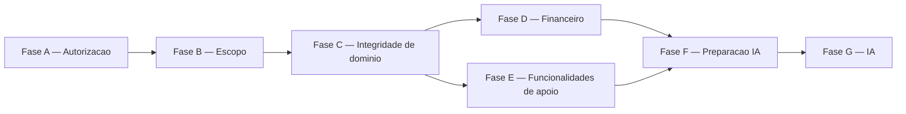

# Roadmap de desenvolvimento

## Objetivo

Este documento define a sequência oficial de desenvolvimento do Breno
- LawSystem a partir do estado registrado em
[current-state.md](current-state.md), em direção ao alvo canônico
descrito em `docs/product/`, `docs/architecture/` e `docs/security/`.

- O roadmap não prova implementação. Somente o HEAD do código prova
  implementação, conforme
  [../README.md](../README.md#hierarquia-das-fontes-de-verdade).
- Um item só pode ser marcado como concluído depois de constatação
  direta no HEAD, não pela existência deste roadmap.
- A ordem entre fases respeita dependências reais de produto e de
  segurança — não deve ser reordenada por conveniência de
  implementação.
- Agentes de IA que executam trabalho a partir deste roadmap não devem
  pular etapas por conveniência, nem antecipar uma fase posterior
  porque parece tecnicamente mais simples.

## Princípios de priorização

1. Segurança e integridade antes de IA.
2. Autorização antes de escopo dependente dela.
3. Escopo antes de agregações dependentes (como o Dashboard).
4. Integridade do domínio antes de automações.
5. Núcleo funcional antes de IA.
6. Decisões já aprovadas (PDRs aceitos) antes de implementar o que
   dependem delas.
7. Decisões abertas (OPEN-001, OPEN-002) não podem ser inventadas nem
   antecipadas por implementação.
8. Testes acompanham a implementação — não são uma etapa posterior
   separada.
9. Documentação de estado (`current-state.md`) deve acompanhar
   entregas relevantes, para não ficar desatualizada em relação ao
   HEAD.

## Estado de partida

Resumo de [current-state.md](current-state.md):

- Multitenancy por schema está implementada; autorização intra-tenant
  tem kernel dinâmico implementado e com casos de teste identificados
  em `apps/accounts/tests/` (execução não verificada), mas não
  aplicado nas views operacionais nem refletido na sidebar, que exibe
  todos os módulos a qualquer usuário autenticado.
- Nenhum módulo operacional (Clientes, Processos, Tarefas, Agenda,
  Financeiro, Dashboard, Chat, Modelos) filtra dados por escopo
  (responsável, equipe ou participação).
- `ParteProcesso` não implementa as três dimensões exigidas por
  PDR-0001; `Tarefa` não implementa os campos exigidos por PDR-0002.
- Financeiro possui apenas a modalidade "único"; Solicitações e
  Honorários não existem como entidades próprias; recorrência e
  parcelamento não estão implementados.
- Chat só possui a sala global; conversas individuais/grupo não
  existem.
- IA jurídica e Assistente/Laboratório são um shell visual sem lógica
  de negócio.
- Casos de teste automatizados cobrem extensivamente o kernel de
  autorização em `apps/accounts` (execução não verificada nesta
  auditoria), mas não cobrem escopo, autorização por objeto nem
  isolamento cross-tenant nos módulos operacionais.
- Nenhum arquivo/anexo de objeto interno (cliente, processo, tarefa
  etc.) existe hoje; a estratégia de segregação por tenant está em
  aberto.

## Sequência oficial

As fases abaixo definem a ordem lógica de dependência (A → B → C →
...). Essa ordem é obrigatória dentro de cada módulo: um módulo não
avança para a fase seguinte sem que seus próprios pré-requisitos de
fase estejam satisfeitos.

O avanço pode, no entanto, ocorrer módulo a módulo: não é obrigatório
concluir uma fase para todos os módulos antes de iniciar a fase
seguinte em um módulo cuja fase anterior já esteja consolidada. Por
exemplo, se a Fase A de Clientes está concluída, Clientes pode avançar
para a Fase B mesmo que Processos, Tarefas, Agenda ou outros módulos
ainda estejam na Fase A.

Essa flexibilidade não se aplica a dependências explicitamente
globais descritas nas fases abaixo — por exemplo, o Dashboard só
recebe escopo depois que os módulos de origem relevantes já tiverem
seus próprios escopos resolvidos, conforme a Fase B.

### Fase A — Consolidar autorização nas operações

Objetivo:

- aplicar autorização de módulo nas views operacionais;
- aplicar as habilitações já existentes no kernel quando exigidas pela
  decisão canônica vigente do módulo;
- definir ou reutilizar a autorização da ação para operações sem
  habilitação correspondente hoje;
- preservar o comportamento já implementado do kernel dinâmico
  (`apps/accounts/permissoes.py`), confirmado pela leitura direta de
  `_permissao_efetiva_com_contexto()`, sem reescrevê-lo;
- criar testes negativos de autorização.

A matriz canônica desta fase é
[../security/authorization-matrix.md](../security/authorization-matrix.md).

Pré-requisitos para sair da fase:

- views relevantes de Clientes, Processos, Tarefas, Agenda, Financeiro,
  Dashboard, Chat, Modelos e Configurações não dependem apenas de
  `@login_required`;
- operações sensíveis (criar, editar, arquivar, excluir, marcar como
  pago, reatribuir, adicionar participante) consultam o kernel
  adequado (`tem_permissao_modulo()`/`tem_habilitacao()`), conforme a
  decisão canônica vigente de cada módulo;
- testes negativos mínimos existem para as operações protegidas;
- configuração administrativa de permissões (`apps/configuracoes`) não
  depende somente do caminho legado de `tipo_conta` quando o alvo
  exigir cobertura do kernel dinâmico (`PapelAcesso`/`UsuarioPapel`).

Esta fase não escreve código de escopo de dados nem resolve a
modelagem de participantes ou de tarefas — apenas aplica autorização
sobre o que já existe.

A regra geral desta fase permanece válida conforme as decisões
canônicas de cada módulo. Processos possui política específica no
[PDR-0010](../product/decisions/PDR-0010-autorizacao-escopo-responsabilidade-processos.md):
na versão atual, autorização binária pelo módulo `processos` satisfaz a
Fase A. As habilitações `processos_criar`, `processos_editar` e
`processos_andamento_adicionar` permanecem no kernel como possibilidade
de evolução futura, sem enforcement e sem constituir dívida bloqueante
da Fase A. Com o WI-0004 aprovado e fechado, Processos pode avançar
verticalmente para a Fase B no WI-0005.

### Fase B — Aplicar escopo de dados

Objetivo:

- filtrar `QuerySet`s de listagem por escopo (responsável, equipe ou
  vínculo equivalente);
- carregar objetos de detalhe/edição/exclusão já dentro do escopo
  autorizado;
- aplicar escopo por responsável, equipe e participação, conforme cada
  módulo;
- aplicar escopo ao Financeiro, distinguindo acesso ao caixa geral de
  acesso restrito;
- criar testes intra-tenant (um usuário não alcança um registro fora
  de seu escopo, dentro do mesmo tenant);
- criar testes cross-tenant relevantes, onde ainda ausentes.

Dependência: Fase A.

Dashboard só recebe escopo depois que os módulos de origem (Clientes,
Processos, Tarefas, Agenda, Financeiro) já aplicarem escopo — a
agregação deve herdar o escopo já resolvido, não implementar sua
própria regra paralela.

### Fase C — Integridade de domínio

Inclui os desalinhamentos confirmados entre o HEAD e as decisões
aprovadas:

- participantes processuais: evoluir `ParteProcesso` para as três
  dimensões exigidas por
  [PDR-0001](../product/decisions/PDR-0001-participantes-processuais.md)
  (vínculo com o escritório, posição estrutural, qualificação
  processual), incluindo suporte a múltiplos clientes representados,
  múltiplas pessoas por polo, Ministério Público e autoridades
  registradas separadamente;
- delegação direta de tarefas: adicionar os campos de criador,
  atribuidor, destinatário da atribuição e data da atribuição exigidos
  por
  [PDR-0002](../product/decisions/PDR-0002-delegacao-direta-de-tarefas.md),
  e implementar a atribuição a outro usuário (a habilitação
  `tarefas_atribuir_outros` já existe no kernel, sem ponto de
  consumo);
- cliente-processo: validar no backend a integridade entre `cliente` e
  `processo` em `TarefaForm`/`CompromissoForm`, rejeitando combinações
  inconsistentes enviadas por `POST`;
- transições de estado: validar transições de status (por exemplo,
  arquivar/reabrir processo, iniciar/concluir/reabrir tarefa,
  concluir/cancelar/reabrir compromisso ou lançamento), hoje aceitas
  sem validação da partir de qualquer estado anterior;
- categoria de custas no financeiro geral: resolver a divergência em
  que `LancamentoFinanceiro.CATEGORIA_CHOICES` ainda inclui
  `"custa_judicial"`, apesar de
  [PDR-0003](../product/decisions/PDR-0003-areas-funcionais-financeiro.md)
  exigir área própria (já existente como `CustaJudicial`).

Esta fase não decide a implementação técnica exata (models, migrations
específicas) — define apenas a ordem e o alvo canônico de cada
desalinhamento.

Dependência: Fase A e Fase B, para que a modelagem evolua sobre uma
base já autorizada e com escopo aplicado.

### Fase D — Consolidar Financeiro

Separar o trabalho pelas quatro áreas funcionais de
[PDR-0003](../product/decisions/PDR-0003-areas-funcionais-financeiro.md):

- **Financeiro geral** — adicionar modalidade de lançamento (único,
  parcelado, recorrente), dependente da resolução de
  [OPEN-001](../product/open-decisions.md#open-001--periodicidades-financeiras-da-primeira-versão)
  para as periodicidades específicas;
- **Custas** — já implementado com saldo correto no backend, conforme
  [PDR-0005](../product/decisions/PDR-0005-custas-por-cliente.md);
  aplicar autorização e escopo (Fases A e B) sobre o que já existe;
- **Solicitações** — modelar `Solicitação` (pagamento/reembolso) como
  entidade própria, conforme
  [PDR-0006](../product/decisions/PDR-0006-solicitacoes-financeiras.md);
  o fluxo final de estados depende da resolução de
  [OPEN-002](../product/open-decisions.md#open-002--etapas-de-aprovação-das-solicitações-financeiras);
- **Honorários** — modelar `Honorario` como entidade própria, com
  valor estimado e valor efetivo separados, conforme
  [PDR-0007](../product/decisions/PDR-0007-honorarios-manuais-antes-ia.md).

Preservar:

- [PDR-0003](../product/decisions/PDR-0003-areas-funcionais-financeiro.md)
  a
  [PDR-0007](../product/decisions/PDR-0007-honorarios-manuais-antes-ia.md)
  como direção canônica de cada área;
- [OPEN-001](../product/open-decisions.md#open-001--periodicidades-financeiras-da-primeira-versão)
  e
  [OPEN-002](../product/open-decisions.md#open-002--etapas-de-aprovação-das-solicitações-financeiras)
  como decisões pendentes — não implementar recorrência final nem o
  fluxo final de aprovação de solicitações antes de sua resolução;
- billing SaaS (`saas_billing`) como domínio distinto do financeiro do
  tenant, sem sincronização automática entre assinatura e lançamento,
  conforme
  [PDR-0003](../product/decisions/PDR-0003-areas-funcionais-financeiro.md).

Dependência: Fase A, Fase B e Fase C (a modelagem de Financeiro deve
evoluir sobre autorização, escopo e integridade já consolidados).

### Fase E — Completar funcionalidades colaborativas e de apoio

Quando sustentado pelo estado atual e pela especificação de módulo:

- **Chat** — implementar conversas individuais e em grupo, conforme
  [chat.md](../product/modules/chat.md), preservando a sala global já
  existente;
- **Modelos** — resolver categorização, versionamento e a rota
  ausente para `EstiloEscritorio` (habilitação `modelos_editar_estilo`
  já existe no kernel, sem ponto de consumo), conforme
  [modelos.md](../product/modules/modelos.md);
- **Configurações** — completar administração de `PapelAcesso` e de
  habilitações por interface (hoje sem rota identificada), e avaliar a
  rota tenant para edição de identidade visual
  (`ConfiguracaoVisual`), hoje administrável apenas via Django Admin;
- **Identidade visual** — conforme apontado acima, dentro de
  Configurações;
- **Fluxos auxiliares** — demais ajustes de apoio sustentados pelas
  especificações de módulo já lidas, sem introduzir funcionalidade nova
  não coberta por elas.

Esta fase não inclui IA — ver Fase F e Fase G.

Dependência: Fase A e Fase B. Não depende da Fase D (Financeiro) nem é
bloqueada por ela, mas ambas dependem da mesma base de autorização e
escopo.

### Fase F — Preparação para IA

Pré-requisitos explícitos de
[PDR-0008](../product/decisions/PDR-0008-ia-apos-nucleo-funcional.md),
todos ainda não consolidados conforme
[current-state.md](current-state.md):

- autorização aplicada nas views operacionais (Fase A);
- escopo de dados aplicado (Fase B);
- isolamento entre tenants preservado (já implementado
  estruturalmente, mas sem teste cross-tenant explícito — completar
  nesta fase, se ainda ausente);
- acesso seguro a documentos, incluindo controle de acesso equivalente
  ao do registro pai quando anexos de objetos internos forem
  introduzidos;
- dados processuais estruturados — depende da evolução de
  `ParteProcesso` (Fase C);
- histórico e rastreabilidade das mutações relevantes;
- núcleo funcional consolidado (Fases A a E);
- confirmação humana exigida em qualquer mutação sugerida por IA
  (honorário, salvamento de modelo, peça gerada).

### Fase G — Inteligência Artificial

Somente depois da Fase F estar consolidada.

Direção, conforme
[inteligencia-artificial.md](../product/modules/inteligencia-artificial.md)
e
[PDR-0008](../product/decisions/PDR-0008-ia-apos-nucleo-funcional.md):

- contexto de processo, dentro do escopo já autorizado ao usuário;
- consulta a documentos autorizados;
- resumo e discussão de estratégia;
- geração e edição de peças, com confirmação humana;
- integração com o módulo Modelos, sem salvar modelo definitivo sem
  confirmação do usuário;
- sugestão de honorários, dependente do model `Honorario` (Fase D) e
  sempre com confirmação humana antes de gerar lançamento definitivo.

IA não amplia escopo: nenhuma resposta ou sugestão de IA pode conceder
acesso a um dado que o usuário não estivesse previamente autorizado a
ver, conforme
[../security/overview.md](../security/overview.md#princípios-canônicos).

## Dependências entre fases

## Critérios para avançar

| Fase | Critério mínimo de saída |
| --- | --- |
| A — Autorização | Views operacionais consultam o kernel exigido pela decisão canônica do módulo (`tem_permissao_modulo()` e, quando aplicável, `tem_habilitacao()`) em vez de depender apenas de `@login_required`; testes negativos mínimos existem. Para Processos, a autorização binária definida no PDR-0010 satisfaz este critério |
| B — Escopo | `QuerySet`s de listagem e objetos carregados por `pk` já nascem filtrados pelo escopo do usuário, em todos os módulos operacionais; testes intra-tenant existem |
| C — Integridade de domínio | `ParteProcesso` sustenta as três dimensões de PDR-0001; `Tarefa` sustenta os campos de PDR-0002; combinações cliente-processo inconsistentes são rejeitadas pelo servidor; transições de estado inválidas são rejeitadas |
| D — Financeiro | Solicitações e Honorários existem como entidades próprias; modalidade de lançamento implementada dentro do que OPEN-001 já permitir decidir; categoria `"custa_judicial"` removida do financeiro geral |
| E — Funcionalidades de apoio | Conversas individuais/grupo existem no Chat; administração de `PapelAcesso`/habilitações possui interface; rota de identidade visual resolvida ou explicitamente adiada por decisão registrada |
| F — Preparação IA | Todos os pré-requisitos de PDR-0008 constatados no HEAD, não apenas planejados |
| G — IA | Cada funcionalidade de IA entregue respeita escopo já autorizado e exige confirmação humana nas mutações, conforme critérios de aceite de [inteligencia-artificial.md](../product/modules/inteligencia-artificial.md) |

## Relação com decisões

| Decisão | Impacto no roadmap |
| --- | --- |
| PDR-0001 — Participantes processuais | Define o alvo da Fase C para `ParteProcesso`; bloqueia a conclusão dessa fase até a modelagem de três dimensões existir |
| PDR-0002 — Delegação direta de tarefas | Define o alvo da Fase C para `Tarefa`; bloqueia a habilitação `tarefas_atribuir_outros`, já existente no kernel mas sem ponto de consumo |
| PDR-0003 — Áreas funcionais do Financeiro | Estrutura toda a Fase D em quatro áreas distintas; impede tratar Financeiro como um único tipo de lançamento |
| PDR-0004 — Previsto e realizado | Já implementado para lançamentos existentes; deve ser preservado ao evoluir Solicitações e Honorários na Fase D |
| PDR-0005 — Custas por cliente | Já implementado corretamente (saldo calculado no backend); Fase D aplica apenas autorização/escopo sobre o que existe |
| PDR-0006 — Solicitações financeiras | Define o alvo de modelagem de Solicitações na Fase D; parcialmente bloqueado por OPEN-002 |
| PDR-0007 — Honorários manuais antes da IA | Define o alvo de modelagem de Honorários na Fase D, como pré-requisito de dados para a sugestão de honorários da Fase G |
| PDR-0008 — IA após núcleo funcional | Define integralmente a Fase F como pré-requisito obrigatório da Fase G; a mais impactante para a ordem geral do roadmap |
| PDR-0009 — Sequência revisada da Fase 2 | Fonte da ordem de dependência entre rodadas que este roadmap consolida em fases; autorização e integridade antes de módulos avançados |
| PDR-0010 — Autorização, escopo e responsabilidade de Processos | Define autorização binária por módulo como suficiente para a Fase A de Processos; habilitações granulares preservadas no kernel são evolução futura e não impedem o avanço para a Fase B após o fechamento do WI-0004 |
| OPEN-001 — Periodicidades financeiras | Bloqueia o detalhamento final de recorrência/parcelamento na Fase D até resolução |
| OPEN-002 — Etapas de aprovação de solicitações | Bloqueia o detalhamento final do fluxo de Solicitações na Fase D até resolução |

## O que não deve ser antecipado

- IA antes de todos os pré-requisitos do PDR-0008 estarem constatados
  no HEAD (não apenas planejados).
- Recorrência financeira final antes da resolução de OPEN-001.
- Fluxo final de aprovação de solicitações antes da resolução de
  OPEN-002.
- Acesso irrestrito de gerente de equipe a dados de sua equipe — hoje
  não existe no kernel (`eh_gerente` não é consultado por
  `permissao_efetiva()`/`habilitacao_efetiva()`), e sua introdução
  exige decisão explícita de escopo, não um efeito colateral da Fase B.
- Acesso jurídico automático de Platform Admin a dados operacionais de
  um tenant — nenhuma decisão canônica concede esse acesso.
- Semântica nova para o campo `nivel` (nível de acesso técnico atual)
  sem decisão explícita na futura matriz de autorização.
- Novos papéis fixos, quando o modelo já aprovado é de papéis
  dinâmicos e configuráveis via `PapelAcesso`.
- Novas habilitações tratadas como aprovadas sem decisão — habilitações
  candidatas registradas em
  [../security/authorization-matrix.md](../security/authorization-matrix.md)
  (por exemplo, `processos_arquivar`, `clientes_editar` estendida a
  desativar/reativar) permanecem candidatas até decisão explícita.

## Atualização do roadmap

- Este documento muda quando decisões de produto/arquitetura ou o
  estado material do HEAD mudarem.
- Implementação não deve ser marcada concluída aqui sem verificação
  direta no HEAD — a fonte de verificação é sempre
  [current-state.md](current-state.md), atualizado a partir do código.
- Work items futuros (quando `docs/delivery/work/` for criado em lote
  posterior) devem apontar para a fase correspondente deste roadmap.
- Mudanças grandes de produto exigem um novo PDR antes de alterar a
  sequência das fases.
- Mudanças arquiteturais relevantes podem exigir um ADR futuro,
  conforme [../governance/decision-index.md](../governance/decision-index.md).
- Material histórico (`docs/history/`) não deve ser reescrito para
  refletir mudanças deste roadmap.

## Próxima unidade de trabalho

Pelo estado auditado em [current-state.md](current-state.md) e pelas
dependências descritas acima, módulos ainda sem autorização aplicada
continuam na **Fase A — Consolidar autorização nas operações**. No
avanço vertical de Processos, porém, o WI-0004 satisfaz a Fase A pela
política específica do PDR-0010; após sua aprovação e fechamento, a
próxima unidade é o WI-0005, pertencente à **Fase B — Aplicar escopo de
dados**. Este documento não define nome de branch, issue ou sprint para
essas unidades de trabalho.

## Referências

- [current-state.md](current-state.md)
- [../product/decisions/](../product/decisions/)
- [../product/open-decisions.md](../product/open-decisions.md)
- [../security/authorization-matrix.md](../security/authorization-matrix.md)
- [../security/authorization-model.md](../security/authorization-model.md)
- [../security/data-scope.md](../security/data-scope.md)
- [../architecture/overview.md](../architecture/overview.md)
- [../architecture/multitenancy.md](../architecture/multitenancy.md)
